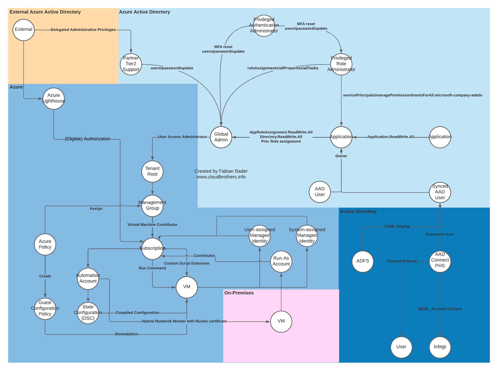

# Microsoft Sentinel hunting queries and Analytics rules

Initially the queries and Analytics Rules in this repository were related to the [Azure Attack Paths](https://cloudbrothers.info/en/azure-attack-paths/) blog post. Over time, I also add new Analytics Rules that are related to other blog posts if mine.

All queries are ready to be used in [Microsoft Sentinel](https://docs.microsoft.com/en-us/azure/sentinel/overview).

## HuntingQueries

1. [Azure VM Run Command or Custom Script execution](./HuntingQueries/AzureVMRunCommandorCustomScriptExecution.yaml)
1. [Changes to Azure Lighthouse delegation](./HuntingQueries/ChangesToAzureLighthouseDelegation.yaml)
1. [Grant high privilege Azure AD role to identity](./HuntingQueries/GrantHighPrivilegeAzureADRoleToIdentity.yaml)
1. [Grant high privilege Microsoft Graph permissions](./HuntingQueries/GrantHighPrivilegeMicrosoftGraphPermissions.yaml)

## AnalyticsRules

* [Azure VM Run Command or Custom Script execution detected](./AnalyticsRules/AzureVmRunCommandOrCustomScriptExecutionDetected.yaml)
* [Dangerous API permission consented](./AnalyticsRules/DangerousAPIPermissionConsented.yaml)
* [High Privileged Role assigned](./AnalyticsRules/HighPrivilegedRoleAssigned.yaml)
* [A new Lighthouse service provider was added](./AnalyticsRules/NewLighthouseServiceProviderWasAdded.yaml)
* [Owner added to high privileged application](./AnalyticsRules/OwnerAddedToHighPrivilegedApplication.yaml)
* [Password reset on high privileged user](./AnalyticsRules/PasswordResetOnHighPrivilegedUser.yaml)
* [Secret added to high privileged application](./AnalyticsRules/SecretAddedToHighPrivilegedApplication.yaml)

# External data sources

Some external data sources need additional modification or are not available through the `externaldata` function directly. In that case I will add them here.

| Source                                                                               | Description                                                                                                                                                   | Modification                                     | Reason                                                 |
| ------------------------------------------------------------------------------------ | ------------------------------------------------------------------------------------------------------------------------------------------------------------- | ------------------------------------------------ | ------------------------------------------------------ |
| `https://mask-api.icloud.com/egress-ip-ranges.csv`                                   | Current list of all IP addresses of the iCloud Private Relay service.  https://developer.apple.com/support/prepare-your-network-for-icloud-private-relay/ | Added column to distiguish between IPv4 and IPv6 | `externaldata` cannot fetch the CSV from Apple servers |
| `https://www.gstatic.com/g1vpn/geofeed`                                              | Current list of all IP addresses of the Google One VPN service.  https://one.google.com/about/vpn/howitworks                                              | Added column to distiguish between IPv4 and IPv6 | `externaldata` cannot fetch the CSV from Google server |
| `https://learn.microsoft.com/en-us/windows-hardware/drivers/ifs/allocated-altitudes` | Microsoft File systems driver allocated filter altitudes                                                                                                      | Convert from markdown to csv                     |                                                        |

# Logic Apps

Along some of my blog posts I release Logic Apps related to Microsoft Sentinel. Those 

| Filename                                                                                                   | Blogpost                                                                                                                                                       |
| ---------------------------------------------------------------------------------------------------------- | -------------------------------------------------------------------------------------------------------------------------------------------------------------- |
| [SyncDfCAlertsWithSentinelIncidents-SMI.arm.json](./SyncDfCAlertsWithSentinelIncidents-SMI.arm.json)       | [Sync Defender for Cloud Alerts with Sentinel Incidents](https://cloudbrothers.info/en/sync-defender-cloud-alerts-sentinel-incidents/#system-managed-identity) |
| [SyncDfCAlertsWithSentinelIncidents-UMI.arm.json](./SyncDfCAlertsWithSentinelIncidents-UMI.arm.json)       | [Sync Defender for Cloud Alerts with Sentinel Incidents](https://cloudbrothers.info/en/sync-defender-cloud-alerts-sentinel-incidents/#user-managed-identity)   |
| [AutoCloseAppleiCloudPrivateRelayIncidents.arm.json](./AutoCloseAppleiCloudPrivateRelayIncidents.arm.json) | [Anonymous IP address involving Apple iCloud Private Relay](https://cloudbrothers.info/en/anonymous-ip-address-involving-apple-icloud-private-relay/)          |
| [Template.arm.json](./Template.arm.json)                                                                   | Empty Logic App template containing all things required for a Sentinel Incident Playbook                                                                       |
